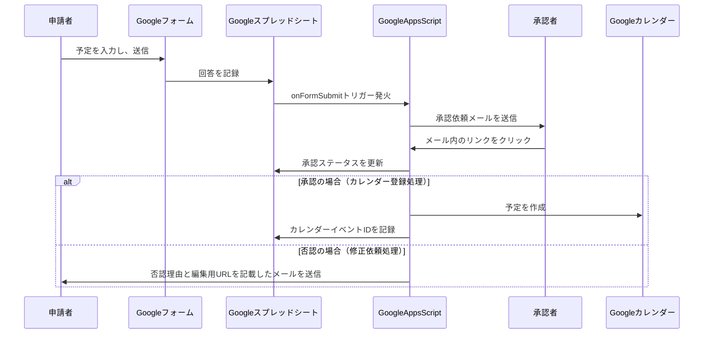

# Googleフォームとカレンダー連携による承認フロー付き予定登録システム

## 概要

このシステムは、Googleフォームへの入力をトリガーとして、Googleカレンダーに予定を登録するプロセスを自動化します。最大の特徴は、予定が登録される前に、指定された承認者による承認フローを挟む点です。これにより、不適切な予定がカレンダーに登録されるのを防ぎ、円滑なスケジュール管理を実現します。

## 主な機能

*   **フォームによる簡単な予定申請:** ユーザーはGoogleフォームに必要な情報（件名、日時、場所、詳細）を入力するだけで、簡単に予定登録の申請ができます。
*   **メールによる承認依頼:** フォームが送信されると、予め設定された承認者へ自動的に承認依頼メールが送信されます。
*   **ワンクリックでの承認・拒否:** 承認者は、メールに記載されたリンクをクリックするだけで、簡単に予定の承認または拒否ができます。
*   **カレンダーへの自動登録:** 承認された予定は、自動的にGoogleカレンダーに登録されます。
*   **ステータスの自動更新:** Googleスプレッドシート上で、各申請のステータス（承認待ち、承認済み、拒否済み）が自動的に更新・管理されます。
*   **柔軟なカスタマイズ:** Google Apps Scriptをベースにしているため、個別の要件に合わせて柔軟にカスタマイズすることが可能です。

## データフロー図（時系列）

## 使い方

1.  **セットアップ:**
    1.  Googleフォームと、回答を記録するGoogleスプレッドシートを作成します。
    2.  Google Apps Scriptに、提供されるスクリプト（`Code.gs`, `approval.html`）をコピー＆ペーストします。
    3.  スクリプト内の設定値（スプレッドシートID、承認者のメールアドレスなど）を自身の環境に合わせて変更します。
    4.  スクリプトのトリガー（フォーム送信時）と、Webアプリケーションとしてのデプロイを行います。
2.  **運用:**
    1.  ユーザーがGoogleフォームから予定を申請します。
    2.  承認者がメールを受信し、内容を確認して承認または拒否します。
    3.  承認されると、自動的にGoogleカレンダーに予定が登録されます。

## 今後の展望

*   フォームの回答が修正された際に、カレンダーの予定も自動的に更新する機能
*   承認者へのリマインダー機能
*   複数人での承認フローへの対応
